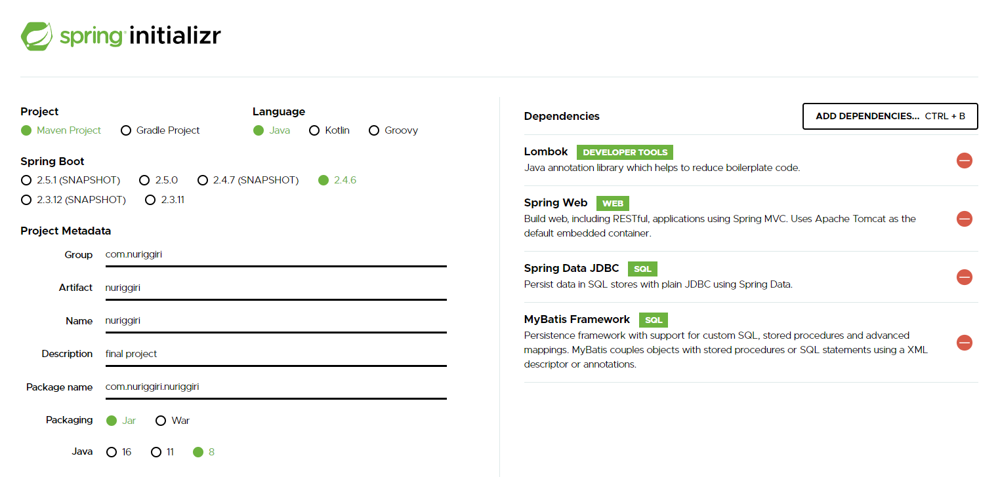

- adminLTE 템플릿 샘플페이지 확인 때문에 우선은 플러그인 다 넣어서
  업로드 파일이 2천개가 넘어가는데 나중에 필요한것만 남기고 지울예정.
  
- controller 작업 전이라 WEB-INF 안에 있는 jsp 파일 확인이 어려워서
  바깥쪽(webapp폴더)에 include랑 home.jsp 추가했어요.
  이것도 controller 작업 되면 확인하고 지울예정.
  


# 파이널 팀 프로젝트 - 1조
- 팀장: 정시윤, 팀원: 원동원, 송미선, 이주형

- 프로젝트: 누리끼리 - 커뮤니티


## 스프링 서블릿 사용
- [스프링 프로젝트 설정 링크](http://start.spring.io)
- 

## 톰캣 포트 변경하기
- resources 폴더 밑에 application.properties 파일 수정
```groovy
# 웹서버 포트 변경
server.port = 8182
```